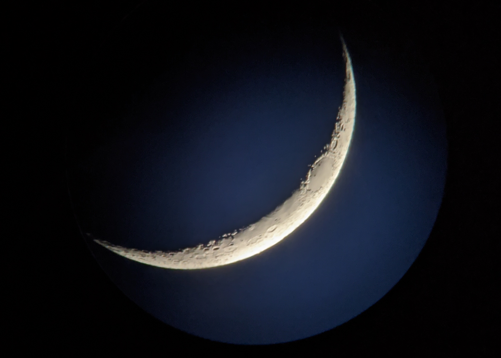
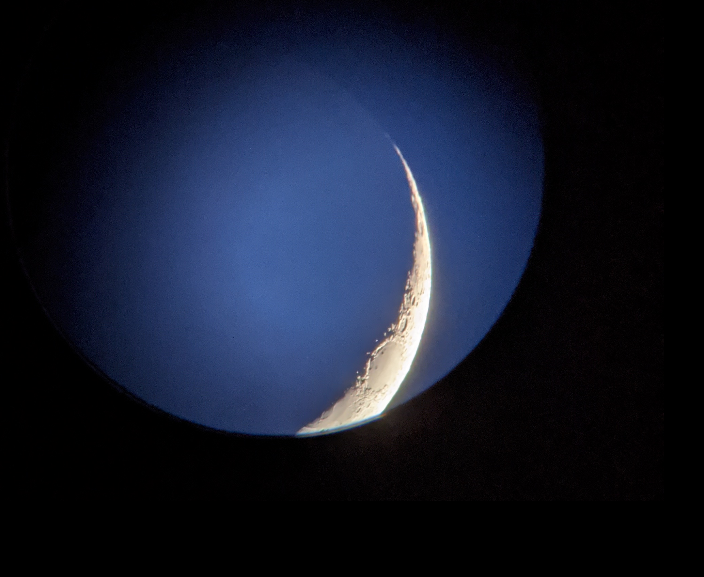
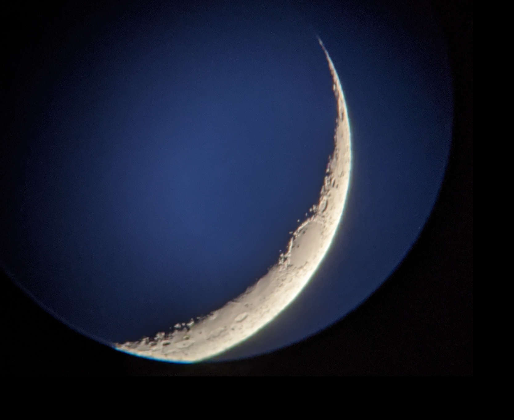

### This is the way
This photos that I am sharing with you here are the first shots of the moon I ever took. I do claim them as perfect, but I will claim them as my first. Each photo I share is in hopes that I will strive to do better.

#### Toenail Moons
I have adopted this term from an amazing astrophysicist, [Dr. Becky Smethurst](http://drbecky.uk.com/). The term is to describe the moon when it is a sliver that resembles a toenail in the sky. I am not sure if she is the originator of this term, but I for sure had not heard it before her. I was introduced to her through youtube, and the way she communicates information is just outstanding!

If you like the toenail moon as much as we do, you might check out her [store](https://dr-becky.creator-spring.com/listing/dr-becky-toenail-moon?product=370&variation=6532&size=1916).

### June 2020
The vignette is from the mount I had to use to attach my phone to the scope. I originally hated how it effected the picture, but the more I go back and look at it the more I find myself smiling. It's not the greatest photo I have taken, but it's the first shots I achieved.

#### Favorite
I do think this is the best of the three I am sharing here. It's decently framed, and the light is well balanced. The sky was bright that night and even so I think that the photo has a weird charm about it.

- Camera: [Pixel 3a XL](/notes/cameras)
- Scope: [Wayne](/notes/telescopes/)
- Eyepeice: Celestron 20mm Erecting
- Filters: N/A

#### Least Favorite
This one may be my least favorite of these three, but what I find appealing about it is the way you can still see the shape of the moon even in spots where the sun don't shine. The light balance on this one is a little too bright, and the camera was not well seated in the mount so it's offset from the frame.

- Camera: [Pixel 3a XL](/notes/cameras)
- Scope: [Wayne](/notes/telescopes/)
- Eyepeice: Celestron 20mm Erecting
- Filters: N/A

### Ehh
This one is ok to me, the camera was not well positioned, and it seems just a hair to blurry. However, the light balance on this one, and the amount of the moon is still a little better.

- Camera: [Pixel 3a XL](/notes/cameras)
- Scope: [Wayne](/notes/telescopes/)
- Eyepeice: Celestron 20mm Erecting
- Filters: N/A
